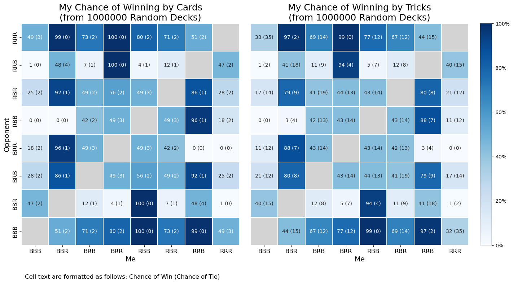

## Introduction

Penney’s Game is a fascinating mind-bender in probability that’s deceptively simple yet full of surprises. Imagine you’re flipping a fair coin repeatedly, trying to predict which sequence of heads and tails will appear first. Here’s the twist: even if two players choose sequences of the same length, the game is not fair! In fact, the order of the chosen sequences creates unexpected advantages, leading to counterintuitive outcomes. This game of strategic sequence-choosing is both a lesson in probability paradoxes and an exploration of how small changes can tip the odds in a seemingly fair game.

## Overview

### Game Rules

In our two variations of Penney's game, they played between two players with a standard deck of 52 cards. There should be 27 blacks cards and 27 red cards, and the deck should be randomly shuffled. The variations differ by scoring system.

1. Player A and Player B each choose a color sequence of length 3.
2. Begin turning over cards from the shuffled deck and place them in a new pile. Continue until a consecutive sequence matches that of Player A's or Player B's.

    1. Variation 1 (by cards): Give all cards in the pile to the corresponding player.
    2. Variation 2 (by tricks): Give one point to the corresponding player, and reset the pile.

4. Repeat step 2 until all cards in the deck are exhausted. Any leftover cards in the pile do not count towards any additional points.
5. Tally points. The player with the most points win.

    1. Variation 1 (by cards): The number of points each player has corresponds to the number of cards in possession.
    2. Variation 2 (by tricks): The number of points each player has corresponds to the number of times the chosen sequence appeared during the game.

### Simulation Results



Alternatively, see html versions for [cards variation](https://htmlpreview.github.io/?https://github.com/XiongCynthia/PenneysGameSimulation/blob/main/figs/cards.html) and [tricks variation](https://htmlpreview.github.io/?https://github.com/XiongCynthia/PenneysGameSimulation/blob/main/figs/tricks.html) (made with Plotly).

These plots were generated through [RunPenneySimulation.ipynb](https://nbviewer.org/github/XiongCynthia/PenneysGameSimulation/blob/main/RunPenneySimulation.ipynb).

## Documentation

```generate_sequence(seed, seq)```

Generates a randomly shuffled sequence from the given values in seq.

Arguments:
- `seed`: Random seed; use no seed if None.
- `seq`: Values for the sequence.

Returns a randomly shuffled sequence.

```generate_data(n:int)```

Augments the existing deck datasets in the "data" folder with `n` additional randomly shuffled decks. Stores the datasets as .npy files.

Arguments:
- `n`: Number of decks
